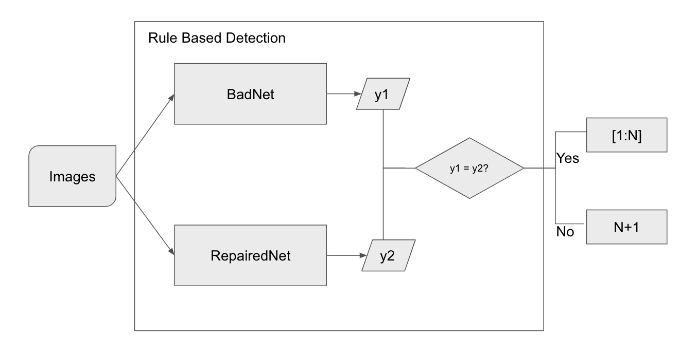
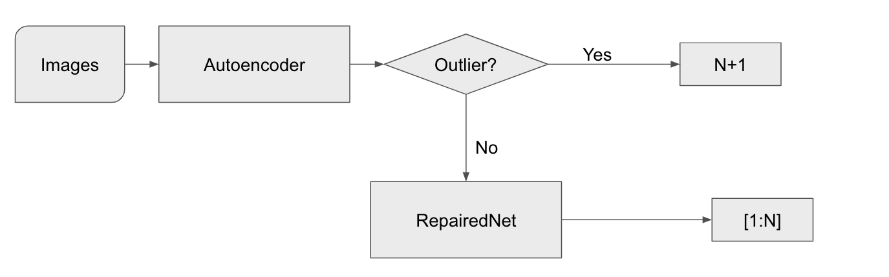

CSAW Project Report
====
- Project Members: Chengyu Jiang (cj1573), Yunzhao Xu (yx2086), Zuquan Song (zs1243)
- Contribution: Chenyu Jiang (33.3%), Yunzhao Xu (33.3%), Zuquan Song(33.3%)

## Code Structure
- code: https://github.com/zuquan-song/CSAW-HackML-2020
```
fine_pruning_model.py, random_pruning_model.py: create repaired model based on badnet & clean validation data
rule_based_model_eval.py, autoencoder_based_model_eval.py: used for test accuracy purpose, if you hope to test the model accuracy, please follow the tutorial.md instruction to test
fixed_models/xx_bd_net.h5: models generated by fine_pruning_model and random_pruning_model, you could find the meaning based on the file name
fix_models/autoencoder.h5: models generated by juypter/Autoencoder-Training.ipynb, you don't need to care about it if it is just testing, because the model would load it automatically.
```
## Attacker Behavior Assumption
We may assume that the attacker tried to use the pruning aware attack strategy.
In this strategy the attacker implement the four step:
1. Trains the baseline DNN on a clean training data set;
2. Prunes the DNN by eliminating dormant neurons;
3. Re-trains the pruned DNN, but this time with the poisoned training dataset.
4. Re-instating all pruned neurons back into the network along with the associated weights and biases

In our case, the attacker implemented a targeted backdoor attack on face recognition where a specific pair of sunglasses in badnet B1.
And in bad net B2, B3, the attacker using the attack strategy discussed above.

## Model Introduction

- We apply pruning based method to generate repaired models. In this project, we apply `fine pruning + rule based detection`, `random pruning + rule based detection`, `random pruning + autoencoder based detection`, `random pruning + autoencoder based detection` strategies for performance comparation.

### Pruning Based Repaired Model

#### Pipeline
According to the attacker behavior assumption, we performed a fine-pruning defense on B1, also in B2, B3.

Firstly, we use the weights from attacker and load it with bad net, this step is used for fine-tune. We apply two ways for pruning, `random pruning`, `fine pruning`:

 1. Random Pruning: We randomly drop 80% of neuron in fc_2 layer and retrained model based on validation data.
 2. Fine Pruning: We use validation data to train the badnet and iteratively prunes neurons from the DNN in increasing order of average activations and records the accuracy of the pruned network in each iteration. Remove the removes decoy neurons. We use validation data to fine-tune the model and produce a repaired one.

To recognize the backdoor as an N + 1 class, we apply two stragtegies for prediction:

 1. Compare the predict result from original badnet and repaired one, if the output class is the same, it shows that the original data is not tainted by sunglasses, else it can be recognized as an N + 1 class. 
 2. Used pretrained AutoEncoder model as an anormaly detection method, if the object was detected as normal, it can be recognized as it was, else it can be recognized as an N + 1 class.

#### Why we use rule based detection method?
- We assume that for green image, the poisoned would behave "perfectly", which means the accuracy for poisoned model on green image could be near to 100%. In addition, for backdoor image, the poisoned would behave "poorly", which means the accuracy for poisoned model on backdoor image could be close to 0%. Based on this assumption, we apply ruled based detection method for backdoor detection.
- Detection pipeline


#### Why we use autoencoder based detection method?


- Suppose the clean data builds up a character space, then the trigger should be a kind of outlier outside this space. Based on the observation, we noticed that all triggers not fit the original images very well, at least detectable by human. So We need a way to see if the input is not similar to the origin one. An Auto Encoder can achieve that by comparing the reconstruction loss of the input and output, and if it is costly for the autoencoder to generate an image, then it should be poisoned.

- The key advantage of this method is highly reusable and reliable. Training an autoencoder can take the advantage of badnet since it will also output correct data for normal    cases. And the only thing we need is filtering the poisoned one. We don't need to do reverse engineering for each model, but just training a new, simple, small size autoencoder as a supplement is all we need.

- Detection pipeline


## Evaluation
After the fine-pruning step, the accuracy of the repaired model on test data is .
#### Source
 - Liu, Kang, Brendan Dolan-Gavitt, and Siddharth Garg. "Fine-pruning: Defending against backdooring attacks on deep neural networks." International Symposium on Research in Attacks, Intrusions, and Defenses. Springer, Cham, 2018.

#### Evaluation Metrics
We evaluate the model based on 3 metrics: 
- Accuracy:
  $$
  Accuracy = \frac{\#correctInferenceNumber}{\#TotalCleanTestNumber}
  $$
  

- Attack Success Rate:
  $$
  AttackSuccessRate = \frac{\#numberOfSuccessBackdoor}{\#TotalPoisonedNumber}
  $$

- Trigger Detection Rate:

$$
TriggerDetectionRate = \frac{\#detectionClass == 1283}{\#TotalPoisonedNumber}
$$

Typically, the higher the accuracy, trigger detection rate, the better. The lower attackSuccessRate, the better.

### Performance

